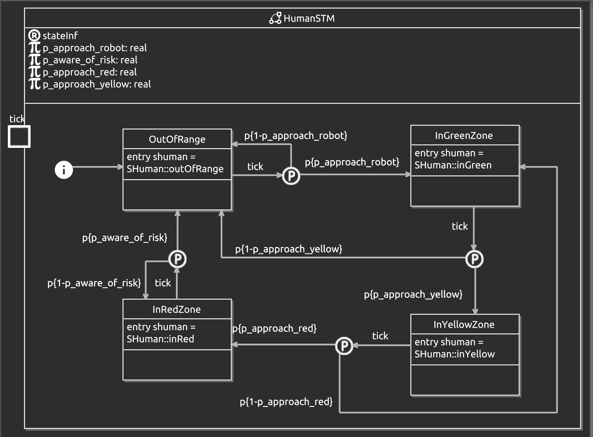
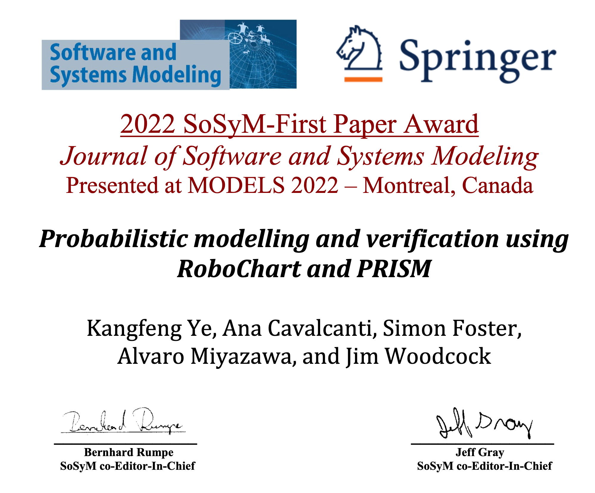

<!-- title: me.html -->
[Home](https://www-users.york.ac.uk/~ky582/) | [Short background](#short-background) | [Research interests](#insresearch-interests-and-summaryins) |  [News](#news) | [Publications](#publications) | [Talks and Presentations](#talks-and-presentations) | 
[Projects](#projects-i-was-or-am-working-on) | [Posts](#posts) | [Showcases](#showcases) | [Academic activities](#academic-activities) | [Contact](#contact)

Kangfeng Ye (also known as Randall Ye)
===================

I am a Research Associate at the University of York, working in the [Department of Computer Science](https://www.cs.york.ac.uk/).

I am creating a simpler academic homepage and migrating contents from [old entry](./old_entry/index.html).

My latest CV is available [here](./CV/Academic_CV-Kangfeng_Ye.pdf).

<!-- @import "[TOC]" {cmd="toc" depthFrom=1 depthTo=6 orderedList=false} -->

<!-- code_chunk_output -->

- [Short background](#short-background)
  - [Research Keywords](#research-keywords)
- [Research interests and summary](#insresearch-interests-and-summaryins)
  - [Probabilistic programming: semantics and verification](#probabilistic-programming-semantics-and-verification)
  - [Formal specification languages](#formal-specification-languages)
    - [Z notation and Circus](#z-notation-and-circus)
    - [CSP](#csp)
  - [Graphical Notations](#graphical-notations)
  - [Formal verification of security protocols](#formal-verification-of-security-protocols)
- [News](#news)
  - [Papers](#papers)
  - [Events (I attended)](#events-i-attended)
- [Awards](#awards)
- [Publications](#publications)
  - [Journal article](#journal-article)
  - [Conference Proceedings](#conference-proceedings)
  - [Books and Chapters](#books-and-chapters)
  - [PhD Thesis](#phd-thesis)
  - [Preprints](#preprints)
- [Talks and Presentations](#talks-and-presentations)
  - [Probabilistic programming](#probabilistic-programming)
  - [Verification of security protocols](#verification-of-security-protocols)
- [Projects (I was or am working on)](#projects-i-was-or-am-working-on)
- [Posts](#posts)
- [Showcases](#showcases)
- [Academic activities](#academic-activities)
- [Contact](#contact)

<!-- /code_chunk_output -->

# Short background

2016 - now: Academia (Formal methods in robotics, probabilistic programming, and security)

: In my research, I use mathematical logic (alphabetised predicate calculus in Unifying Theories of Programming - UTP) to give ==probabilistic semantics== (denotational and operational semantics) to a domain-specific language (**RoboChart**) in robotics, with support of modelling time and probability, (2) develop ==automated verification tools== using modern model-based techniques (model transformation, validation, and generation) and formal verification (model checking and theorem proving), and apply theoretical semantics and practical tools to a variety of case studies. 

: I am a developer of [RoboTool](https://robostar.cs.york.ac.uk/robotool/) supporting probabilistic verification for robotic applications, and a contributor [^isabelle_utp] of [Isabelle/UTP](https://isabelle-utp.york.ac.uk/), a unifying semantic framework supporting theorem proving. Both tools are being developed in the [RoboStar](https://robostar.cs.york.ac.uk) group.

2012 - 2016: PhD at the University of York (Formal methods) 

: Supervised by Prof. Jim Woodcock. _The most right choice in my career is to have a PhD in formal methods with Jim. Every time when I think of him, I always feel :slightly_smiling_face: :sunny: and calm and passionate :fire: in research_ because of the knowledge he taught me and the way being a good researcher.

: :books: Thesis: [Model Checking of State-Rich Formalisms (By Linking to Combination of State-based Formalism and Process Algebra)](https://etheses.whiterose.ac.uk/15526/)

2004 - 2012: Industry (Embedded Software Engineer/Lead)
: Led a team (4-8 members) to develop embedded software for lithography, Ethernet Datacenter Switch, and Communication devices.  C/C++, MCU, Linux, VxWorks

## Research Keywords
:key: Formal verification :key: Formal semantics :key: Probabilistic programming languages :key: Probabilistic model checking :key: Probabilistic theorem proving :key: Model-based Software Engineering :key: Cyber-Physical Systems :key: Cryptographic security protocols :key: Tool development

# <ins>Research interests and summary</ins>

## Probabilistic programming: semantics and verification 

:arrow_right: Probabilistic semantics and verification for RoboChart using PRISM
- :high_brightness: _fully automatic verification of state machines notation using probabilistic model checking_
- :books:: [Probabilistic Modelling and Verification Using RoboChart and PRISM](https://doi.org/10.1007/s10270-021-00916-8)
- :hammer_and_wrench:: Three plugins in [RoboTool](https://robostar.cs.york.ac.uk/robotool/) for :one: the PRISM metamodel, :two: RoboChart model transformation to PRISM and verification, and :three: Probabilistic properties.
- :ledger: [RoboChart case studies](https://robostar.cs.york.ac.uk/case_studies/), [High-Voltage Controller (HVC)](https://github.com/UoY-RoboStar/hvc-case-study/tree/prism_verification), [UV light-treatment (UVC)](https://github.com/UoY-RoboStar/uvc-case-study)
  + :books: [Probabilistic Modelling and Safety Assurance of an Agriculture Robot Providing Light-Treatment](10.1109/CASE56687.2023.10260395)

:arrow_right: Probabilistic Unifying Relations (ProbURel)
- :high_brightness: _a probabilistic semantics framework_ and :high_brightness: _a probabilistic programming language_
- :books:: [Probabilistic unifying relations for modelling epistemic and aleatoric uncertainty: Semantics and automated reasoning with theorem proving](https://doi.org/10.1016/j.tcs.2024.114876)
- :hammer_and_wrench:: [A theory for ProbURel and algebraic laws](https://github.com/RandallYe/probabilistic_programming_utp/tree/main/probability/probabilistic_relations)  
- :ledger: [Six proved examples](https://github.com/RandallYe/probabilistic_programming_utp/tree/main/probability/probabilistic_relations/Examples) including [Monty Hall problem](https://en.wikipedia.org/wiki/Monty_Hall_problem), a forgetful Monty, [Doctor Who's Tardis Attacker], robot localisation, cancer diagnosis (Bayesian approach), coin flip till heads, throw a pair of dice till they have the same outcome.  

:arrow_right: Probabilistic designs
- :high_brightness: _a theory for nondeterministic probabilistic sequential programming language_ 
- :books:: [Automated Reasoning for Probabilistic Sequential Programs with Theorem Proving](https://doi.org/10.1007/978-3-030-88701-8_28)
- :hammer_and_wrench:: [A theory for probabilistic designs in Isabelle/HOL](https://github.com/RandallYe/probabilistic_programming_utp/tree/main/probability/probabilistic_designs)  
- :ledger: [The proof of an algorithm to get uniform distribution from just a fair coin, and a few other examples from He's and Hehner's PPP papers](https://github.com/RandallYe/probabilistic_programming_utp/tree/main/probability/probabilistic_designs/examples) 

:arrow_right: Quantitative Analysis of UML Activity Diagrams
- :high_brightness: _A UML Profile for Quantitative Annotations_ :high_brightness: _Semantics of Quantitative Activity Diagrams in PRISM_ :high_brightness: _Parametric Quantitative Analysis_ :high_brightness: _Synthesis_ :high_brightness: _Three Markov models (DTMC, MDP, and CTMC)_
- :books:: [Quantitative Assurance and Synthesis of Controllers from Activity Diagrams](https://arxiv.org/abs/2403.00169)
- :hammer_and_wrench:: [Eclipse-based Plugins](https://github.com/RandallYe/QANAD), fully automated, support PRISM and Storm 
- :ledger: [Seven evaluated examples](https://github.com/RandallYe/QANAD/tree/master/Examples) including Six-sided dice, Digital camera, Fruit picking, Travel web, IT Support, and Travel management from literature. Hospital :hospital: Intralogistics Robot :robot: by us  
  + 14 Markov models: 6 in DTMCs, 3 in MDPs, and 5 in CTMCs
- :clapper: [Installation - 1: Eclipse, Papyrus and Epsilon](https://www.youtube.com/watch?v=EhhQAlD1P2Q) and [Installation - 2: Configuration](https://www.youtube.com/watch?v=NTyLdK8tQvo)

:arrow_right: QoS (energy efficiency and service availability) analysis of O-RAN xApps  
- :high_brightness: _Compared 6 configurations of control policy for different QoS results_ 
- :books:: [Towards Achieving Energy Efficiency and Service Availability in O-RAN via Formal Verification](https://arxiv.org/abs/2411.03943), to appear in DataMod24
- :hammer_and_wrench: [PRISM models](https://github.com/RandallYe/ORAN-xApp-QoS-PRISM-Models)  
- :ledger: A scenario with 3 Radio cards + 9 UEs (user equipments) where UEs can be switched on and off based on a continuous distribution (exponential).

## Formal specification languages 
### Z notation and Circus

:arrow_right: Model checking of Circus 
- :high_brightness: _Semantics of Circus in CSP || B_ :high_brightness: _Automatic transformation of Circus to CSP || B_ :high_brightness: _Model checking using ProB_ 
- :books:: [Model Checking of State-Rich Formalisms (By Linking to Combination of State-based Formalism and Process Algebra)](https://etheses.whiterose.ac.uk/15526/), [Model checking of state-rich formalism by linking to $CSP\,\Vert \,B$](https://doi.org/10.1007/s10009-015-0402-1)
- :hammer_and_wrench:: [Circus2CSPZ translator](https://github.com/RandallYe/Circus2ZCSP), Java, based on the CZT project
- :ledger: [Reactive buffer](https://github.com/RandallYe/Circus-Programs/tree/master/Cases/ReactiveBuffer), [Steam boiler](https://github.com/RandallYe/Circus-Programs/tree/master/Cases/SteamBoiler), [ESEL](https://github.com/RandallYe/Circus-Programs/tree/master/Cases/ESEL)

:arrow_right: An ISO Z and Circus Parser and Typechecker 
- :high_brightness: _A complete implementation[^ISOZ] of ISO Z Standard ([ISO/IEC 13568:2002](https://www.iso.org/standard/21573.html))_ :high_brightness: _Most Circus Syntax_ 
- :books:: Haven't published yet :slightly_frowning_face: 
- :hammer_and_wrench:: [ISOZ and Circus Parser and TypeChecker](https://github.com/RandallYe/ISOZ-Parser-TypeChecker), implemented using Alex and Happy in Haskell, also C++. 
- :ledger: Examples from the standard documentation, Circus buffer, reactive buffer, Circus steam boiler

:arrow_right: Reactive Relations[^reactive_relations] 
- :high_brightness: _A mechanised theory of Reactive Relations in Isabelle/HOL_
- :books:: [Automated verification of reactive and concurrent programs
by calculation](https://doi.org/10.1016/j.jlamp.2021.100681)
- :hammer_and_wrench:: [The theory of Reactive Relations in UTP](https://github.com/isabelle-utp/utp-main/tree/master/theories/reactive)
- :ledger: Reactive buffer

### CSP

:arrow_right: Animation of RoboChart 
- :high_brightness: _An Interaction-Trees-based deterministic CSP in Isabelle/HOL_ 
- :books:: Formally verified animation for RoboChart using interaction trees at [Journal of Logical and Algebraic Methods in Programming](https://doi.org/10.1016/j.jlamp.2023.100940) and at [ICFEM2022](https://doi.org/10.1007/978-3-031-17244-1_24)
- :hammer_and_wrench:: [The theory of Interaction Trees based CSP in Isabelle/UTP](https://github.com/isabelle-utp/interaction-trees)
- :ledger: [Autonomous Chemical Detector](https://github.com/isabelle-utp/interaction-trees/tree/master/RoboChart/examples/RoboChart_ChemicalDetector_autonomous), [Patrol Robot](https://github.com/isabelle-utp/interaction-trees/tree/master/RoboChart/examples/Patrol_Robot)

## Graphical Notations

:arrow_right: Assume-Guarantee Reasoning of Simulink
- :high_brightness: _A mechanised theory for assume-guarantee reasoning of discrete Simulink in Isabelle/HOL_
- :books:: [Compositional Assume-Guarantee Reasoning of Control Law Diagrams Using UTP](https://doi.org/10.1007/978-3-030-15792-0_10), [Technical report for the mechanised theory](https://eprints.whiterose.ac.uk/129640/15/Compositional_Assume_Guarantee_Reasoning_of_Control_Law_Diagrams_using_UTP_Tech_Report.pdf)
- :hammer_and_wrench:: [The theory of Assume-Guarantee reasoning of Simulink](https://github.com/RandallYe/Compositional_AG_Reasoning_Simulink_UTP)
- :ledger: [A post landing finalize subsystem in aircraft cabin pressure control](https://github.com/RandallYe/Compositional_AG_Reasoning_Simulink_UTP/blob/main/post_landing_finalize_1.thy)

:arrow_right: Probabilistic semantics and animation for the state-machine based RoboChart (see details above) 

:arrow_right: Quantitative Analysis of UML Activity Diagrams (see details above) 

## Formal verification of security protocols
:arrow_right: Formal verification of security protocols using animation, a lightweight model checker
- :high_brightness: _An Interaction-Trees-based deterministic CSP used to model security protocols_ :high_brightness: _Manual + Automatic verification_ :high_brightness: _User-guided accessible verification_ :high_brightness: _Terminal + Web interfaces_
- :books:: [User-Guided Verification of Security Protocols via Sound Animation](https://doi.org/10.1007/978-3-031-77382-2_3)
- :hammer_and_wrench:: [A theory of modelling and verifying security protocols in Isabelle/HOL](https://github.com/RandallYe/Animation_of_Security_Protocols)
- :ledger: [Needham-Schroeder Public Key Protocol](https://github.com/RandallYe/Animation_of_Security_Protocols/tree/master/NSPK), [Diffie-Hellman key agreement](https://github.com/RandallYe/Animation_of_Security_Protocols/tree/master/Diffie_Hellman)

Member of Groups
---
- [Circus](https://www.cs.york.ac.uk/circus/) [^circus]
- [RoboStar](https://robostar.cs.york.ac.uk/)
- [SysTRON Lab](https://systronlab.github.io/)

# News
## Papers
2025-04-18 DataMod24 paper available online
: [Towards Achieving Energy Efficiency and Service Availability in O-RAN via Formal Verification](https://doi.org/10.1007/978-3-031-87908-1_9) from Springer

2025-01-16 Interviewed by [Dr. Daniel Shea](https://newbooksnetwork.com/hosts/profile/1dea1d2c-5a16-4797-82ae-edfb1f79eb99) on Scholarly Communication
: I was interviewed on [Scholarly Communication](https://newbooksnetwork.com/category/academic-partners/scholarly-communications) by Dr. Daniel Shea from Karlsruhe Institute of Technology (KIT) for one of my co-authored paper: [Probabilistic Modelling and Verification Using RoboChart and PRISM](https://doi.org/10.1007/s10270-021-00916-8). The paper was published in the journal of [Software and Systems Modeling](https://www.sosym.org/) and won the [Journal-First award](https://www.sosym.org/journal_first/). I was invited to present the paper at [MODELS 2022](https://conf.researchr.org/home/models-2022). 
The episode is now available [here](https://newbooksnetwork.com/use-sequential-internal-review-to-improve-your-next-submission). 

2024-11-06 The preprint of the DataMod24 paper is available
: The preprint of our paper "Towards Achieving Energy Efficiency and Service Availability in O-RAN via Formal Verification" can be found [here](https://arxiv.org/abs/2411.03943).

2024-10-07 Paper accepted by DataMod24
: Our paper submitted to [DataMod24](https://datamod2024.github.io/) has been accepted for publication. This paper is about the quantitative analysis of a control policy used in an O-RAN xApp to achieve energy efficiency and guarantee service availability. We use PRISM to verify a scenario with 3 radio cells (stations) and 9 UEs (user equipments) while UEs are dynamically and uncertainly switched on and off.

2024-10-01 The preprint of the SEFM2024 paper is available
: The preprint of our paper "User-Guided Verification of Security Protocols via Sound Animation" can be found [here](https://arxiv.org/abs/2410.00676). Please note that **this is not the final camera ready version**

2024-09-25
: Our TCS journal paper (about probabilistic programming) is now [online](https://doi.org/10.1016/j.tcs.2024.114876 "TCS paper")

2024-09-12 
: Our TCS journal paper (about probabilistic programming) has been accepted for publication and should be online soon.
: The first draft is available [online at arxiv](https://arxiv.org/abs/2303.09692)

2024-09-01
: A joint Festschrift paper, titled "[A Tour Through the Programming Choices: Semantics and Applications](https://link.springer.com/chapter/10.1007/978-3-031-67114-2_11)", with Pedro Ribeiro, Frank Zeyda, and Alvaro Miyazawa to celebrate Prof. Jim Woodcock's retirement from York. He was my PhD supervisor and a line manager in RoboStar. 

2024-08-22
: Our paper (==_User-Guided Verification of Security Protocols via Sound Animation_==) submitted to [SEFM24](https://sefm-conference.github.io/2024/) has been accepted for publication.

2023-12-19
: Our JLAMP journal paper (==_[Formally verified animation for RoboChart using interaction trees](https://doi.org/10.1016/j.jlamp.2023.100940)_==) has been accepted for publication.

## Events (I attended)
2025-07-15 to 2025-07-16: CHEDDAR and 'Friends' Symposium and Industry Days, London 
: I presented the select CHEDDAR highlight project 3.2 (formal verification) from the University of York (collaborated with the University of Glasgow and Imperial College London). My slides are available [here](./Cheddar/Cheddar_20250715/CHEDDAR_York_P3.2_20250715.pdf).

2025-03-03 to 2025-03-06: MWC2025 at Barcelona, Spain 
: A [Linkedin post](https://www.linkedin.com/posts/randallye_who-can-or-who-wants-to-formally-activity-7304257438197731330-y6Zl?utm_source=share&utm_medium=member_desktop&rcm=ACoAABIDDMQBY24b1UzaJYtEAEtEUs8fmBnVAjM) about our demo "User-Guided Verification of Security Protocols via Sound Animation", also [a video](https://www.youtube.com/watch?v=8FO6KT6EMqM) available at Youtube.

2024-11-06 to 2024-11-08: SEFM2024 at Aveiro, Portugal
: I presented our work "User-Guided Verification of Security Protocols via Sound Animation" at [SEFM2024](https://sefm-conference.github.io/2024/). The slide is available [here](./SEFM2024/SEFM2024_presentation.pdf)

2024-09-26 Cheddar All-hands meeting in Imperial
: Presentations from new partners, demonstration discussion, and updates from each pillar. I have updated P3.2 from York regarding accessible formal techniques using ==_sound animation_== and quantitative analysis of energy efficiency and service availability in O-RAN xApps (to optimise QoS).

2024-09-04 Jim's Festschrift
: I have been greatly benefited from Jim’s inspiration and mentorship. I and Pedro presented our paper "[A Tour Through the Programming Choices: Semantics and Applications](https://link.springer.com/chapter/10.1007/978-3-031-67114-2_11)". It's my pleasure to present Frank's preferential choice and my work ProbURel (collaborated with Jim and Simon) in probabilistic semantics and theorem proving. 

2024-07-25 6G Summit in Leeds
: Co-located with WINCOM2024 

2024-07-09
: Cheddar project meeting at the Cranfield University

2024-06-27
: Gave a talk in the University's [Celebrating Spaces: Connecting Researchers](https://sites.google.com/york.ac.uk/celebrating-spaces/home?authuser=0). It is a 5-minute Lightning Talk. My talk is about [Guarantee correctness and performance of probabilistic algorithms](https://sites.google.com/york.ac.uk/celebrating-spaces/home?authuser=0).

2024-06-05 to 06
: Cheddar Pillar 1 and P3.2 meetings at the University of Glasgow

2024-03-28
: Cheddar P3.1 and P3.2 joint meeting at Imperial College London

2024-03-12
: Cheddar Bi-Annual meeting at the University of York

# Awards 
2022 SoSyM Journal-first
: For the paper [Probabilistic Modelling and Verification Using RoboChart and PRISM](https://doi.org/10.1007/s10270-021-00916-8) 

# Publications
## Journal article

1. [==**ProbURel**==] K. Ye, J. Woodcock, and S. Foster, “Probabilistic unifying relations for modelling epistemic and aleatoric uncertainty: Semantics and automated reasoning with theorem proving,” Theoretical Computer Science, p. 114 876, 2024, issn: 0304-3975.  doi: [10.1016/j.tcs.2024.114876](https://doi.org/10.1016/j.tcs.2024.114876).

2. [==**RoboChart_ITrees**==] K. Ye, S. Foster, and J. Woodcock, “Formally verified animation for RoboChart using interaction trees,” Journal of Logical and Algebraic Methods in Programming, vol. 137, p. 100 940, 2024, issn: 2352-2208.  doi: [10.1016/j.jlamp.2023.100940](https://doi.org/10.1016/j.jlamp.2023.100940).

3. [==**RoboChart_PRISM**==] K. Ye, A. Cavalcanti, S. Foster, A. Miyazawa, and J. Woodcock, “Probabilistic modelling and verification using RoboChart and PRISM,” en, Software and Systems Modeling, vol. 21, no. 2, pp. 667–716, Apr. 2022, issn: 1619-1374.  doi: [10.1007/s10270-021-00916-8](https://doi.org/10.1007/s10270-021-00916-8).

4. [==**Reactive_Relations**==] S. Foster, K. Ye, A. Cavalcanti, and J. Woodcock, “Automated Verification of Reactive and Concurrent Programs by Calculation,” Journal of Logical and Algebraic Methods in Programming, vol. 121, p. 100 681, Jun. 2021, arXiv:2007.13529 [cs], issn: 23522208.  doi:
[10.1016/j.jlamp.2021.100681](https://doi.org/10.1016/j.jlamp.2021.100681).

5. [==**ModelChecking_Circus**==] K. Ye and J. Woodcock, “Model checking of state-rich formalism by linking to $CSP\,\Vert \,B$,” en, International Journal on Software Tools for Technology Transfer, vol. 19, no. 1, pp. 73–96, Feb. 2017, issn: 1433-2787.  doi: [10.1007/s10009-015-0402-1. (visited on 10/13/2023)](https://doi.org/10.1007/s10009-015-0402-1. (visited on 10/13/2023)).

## Conference Proceedings

1. K. Ye, R. Metere, and P. Yadav, “User-Guided Verification of Security Protocols via Sound Animation,” in Software Engineering and Formal Methods (SEFM), Springer Nature Switzerland, Nov. 2024, pp. 33–51, isbn: 9783031773822.  doi: [10.1007/978-3-031-77382-2_3](https://doi.org/10.1007/978-3-031-77382-2_3).

1. R. Metere, K. Ye, Y. Gu, et al., “Towards Achieving Energy Efficiency and Service Availability in O-RAN via Formal Verification,” in From Data to Models and Back (DataMod2024), Springer International Publishing, 2024.  doi: [10.1007/978-3-031-87908-1_9](https://doi.org/10.1007/978-3-031-87908-1_9).

1. M. Adam, K. Ye, D. A. Anisi, A. Cavalcanti, J. Woodcock, and R. Morris, “Probabilistic Modelling and Safety Assurance of an Agriculture Robot Providing Light-Treatment,” in 2023 IEEE 19th International Conference on Automation Science and Engineering (CASE), ISSN: 2161-8089, Aug. 2023, pp. 1–7.  [10.1109/CASE56687.2023.10260395](https://doi.org/10.1109/CASE56687.2023.10260395).

2. K. Ye, S. Foster, and J. Woodcock, “Formally Verified Animation for RoboChart Using Interaction Trees,” en, in Formal Methods and Software Engineering, A. Riesco and M. Zhang, Eds., ser. Lecture Notes in Computer Science, Cham: Springer International Publishing, 2022, pp. 404–420, isbn: 978-3-031-17244-1.  [10.1007/978-3-031-17244-1_24](https://doi.org/10.1007/978-3-031-17244-1_24).

3. K. Ye, S. Foster, and J. Woodcock, “Automated Reasoning for Probabilistic Sequential Programs with Theorem Proving,” en, in Relational and Algebraic Methods in Computer Science, U. Fahrenberg, M. Gehrke, L. Santocanale, and M. Winter, Eds., ser. Lecture Notes in Computer Science, Cham: Springer International Publishing, 2021, pp. 465–482, isbn: 978-3-030-88701-8.  [10.1007/978-3-030-88701-8_28](https://doi.org/10.1007/978-3-030-88701-8_28).

4. J. Woodcock, A. Cavalcanti, S. Foster, A. Mota, and K. Ye, “Probabilistic Semantics for RoboChart,” en, in Unifying Theories of Programming, P. Ribeiro and A. Sampaio, Eds., ser. Lecture Notes in Computer Science, Cham: Springer International Publishing, 2019, pp. 80–105, isbn: 978-3-030-31038-7.  [10.1007/978-3-030-31038-7_5](https://doi.org/10.1007/978-3-030-31038-7_5).

5. S. Foster, K. Ye, A. Cavalcanti, and J. Woodcock, “Calculational Verification of Reactive Programs with Reactive Relations and Kleene Algebra,” en, in Relational and Algebraic Methods in Computer Science, J. Desharnais, W. Guttmann, and S. Joosten, Eds., ser. Lecture Notes in Computer Science, Cham: Springer International Publishing, 2018, pp. 205–224, isbn: 978-3-030-02149-8.  [10.1007/978-3-030-02149-8_13](https://doi.org/10.1007/978-3-030-02149-8_13).

## Books and Chapters

1. P. Ribeiro, K. Ye, F. Zeyda, and A. Miyazawa, “A tour through the programming choices: Semantics and applications,” in The Application of Formal Methods. Springer Nature Switzerland, 2024, pp. 261–305, isbn: 9783031671142.  [10.1007/978-3-031-67114-2_11](https://doi.org/10.1007/978-3-031-67114-2_11).

2. J. Woodcock, S. Foster, A. Mota, and K. Ye, “RoboStar Technology: Modelling Uncertainty in RoboChart Using Probability,” en, in Software Engineering for Robotics, A. Cavalcanti, B. Dongol, R. Hierons, J. Timmis, and J. Woodcock, Eds., Cham: Springer International Publishing, 2021, pp. 413–465, isbn: 978-3-030-66494-7.  doi: [10.1007/978-3-030-66494-7_13](https://doi.org/10.1007/978-3-030-66494-7_13). 

3. K. Ye, S. Foster, and J. Woodcock, “Compositional Assume-Guarantee Reasoning of Control Law Diagrams Using UTP,” en, in From Astrophysics to Unconventional Computation: Essays Presented to Susan Stepney on the Occasion of her 60th Birthday, ser. Emergence, Complexity and Computation, A. Adamatzky and V. Kendon, Eds., Cham: Springer International Publishing,
2020, pp. 215–254, isbn: 978-3-030-15792-0.  doi: [10.1007/978-3-030-15792-0_10](https://doi.org/10.1007/978-3-030-15792-0_10). 

## PhD Thesis
1. K. Ye, “Model Checking of State-Rich Formalisms (By Linking to Combination of State-based Formalism and Process Algebra),” en, phd, University of York, Aug. 2016.  url: https://etheses.whiterose.ac.uk/15526/.

## Preprints
1. K. Ye and J. Woodcock, RoboCertProb: Property Specification for Probabilistic RoboChart Models, 2024. arXiv: [2403.08136](https://arxiv.org/abs/2403.08136) [cs.LO].

2. K. Ye, F. Yan, and S. Gerasimou, Quantitative Assurance and Synthesis of Controllers from Activity Diagrams, 2024. arXiv: [2403.00169](https://arxiv.org/abs/2403.00169) [cs.LO].

# Talks and Presentations
## Probabilistic programming
Lightning Talk on 2024-06-27
: A 5-minute Lightning Talk, given at the University's [Celebrating Spaces: Connecting Researchers](https://sites.google.com/york.ac.uk/celebrating-spaces/home?authuser=0). The talk video is now available at [Youtube](https://www.youtube.com/watch?v=9GZMzrVsnxY). My talk is about [Guarantee correctness and performance of probabilistic algorithms](https://sites.google.com/york.ac.uk/celebrating-spaces/home?authuser=0).

## Verification of security protocols
Presentation at CHEDDAR and 'Friends' Symposium and Industry Days - 15/16 July, London
: I presented the select CHEDDAR highlight project 3.2 (formal verification) from the University of York (collaborated with the University of Glasgow and Imperial College London). My slides are available [here](./Cheddar/Cheddar_20250715/CHEDDAR_York_P3.2_20250715.pdf).

Presentation at SEFM2024 on the 7th of November, 2024
: I presented our paper "User-Guided Verification of Security Protocols via Sound Animation" at [SEFM2024](https://sefm-conference.github.io/2024/). In this work, we address the accessibility of formal verification of security protocols for designers and the soundness guarantee of automatically generated animators. The slide is available [here](./SEFM2024/SEFM2024_presentation.pdf). More details can be found [this post](./Posts/SEFM_DataMod/cheddar_updates.html).

# Projects (I was or am working on)
CHEDDAR (Feb 2024 - )
: The Communications Hub for Empowering Distributed Cloud Computing Applications and Research [(CHEDDAR)](https://cheddarhub.org/)

SESAME (June 2023 - Jan 2024)
: [Secure and Safe Multi-Robot Systems](https://www.sesame-project.org/)

RoboCalc and RoboTest (April 2018 - June 2023)
: EPSRC projects in the [RoboStar](https://robostar.cs.york.ac.uk/) group

[CyphyAssure](https://www.cs.york.ac.uk/circus/CyPhyAssure/) (June 2021 - September 2021)
: A EPSRC-funded (Simon Foster's fellowship) project 

Compositional Assume-Guarantee Reasoning of Control Law Diagrams using UTP (Oct 2017 - March 2018)
: A [VETSS](https://vetss.org.uk/) sponsored project

[INTO-CPS](https://into-cps.org/) (Nov 2016 - Dec 2017)
: Integrated Tool Chain for Model-based Design of Cyber-Physical Systems

# Posts

2024-11-06 to 08
: [Application of formal verification in security protocols and O-RAN xApps](./posts/SEFM_DataMod/SEFM_DataMod_2024.html)

# Showcases

# Academic activities
Organiser of [WINCOM2024 Hackathon and Demo](https://www.wincom-conf.org/WINCOM_2024/?page=demo-Hackathon)
: Organised with Ashan Khan together

JWFS 2024 PC member
: The Festschrift for [Prof. Jim Woodcock][jim_home] on the occasion of his retirement from the University of York

# Contact
- Email: kangfeng.ye@york.ac.uk
- [GitHub - RandallYe](https://github.com/RandallYe)
- [Linkedin - Randall Ye](https://www.linkedin.com/in/randallye)
- [Google Scholar - Kangfeng Ye](https://scholar.google.com/citations?user=PbLkCR8AAAAJ&hl=en)
- [DBLP - Kangfeng Ye](https://dblp.org/pid/193/5774.html)

[^circus]: Circus members are now mostly in RoboStar
[^isabelle_utp]: I made a few contributions to Isabelle/UTP, particularly in reactive designs and interaction trees. But in general, I am a user of Isabelle/UTP, and not a developer. 
[^ISOZ]: Except semantics transformation rules (a small part is implemented)
[^reactive_relations]: relatively small contribution to this work, mainly in the verificaiton of the reactive buffer, and gave Simon some insight on the verificaiton strategy when he was developing the theory. But this is very beautiful work and it is nice to mention here.

[jim_home]: <https://sites.google.com/york.ac.uk/jim-woodcock-home-page> (Jim's homepage)