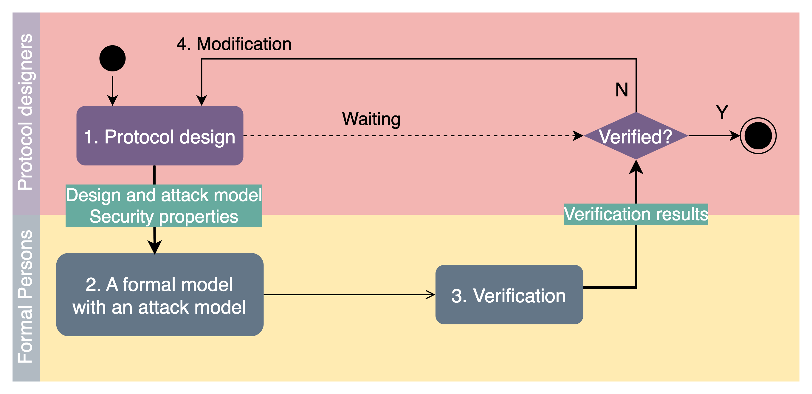
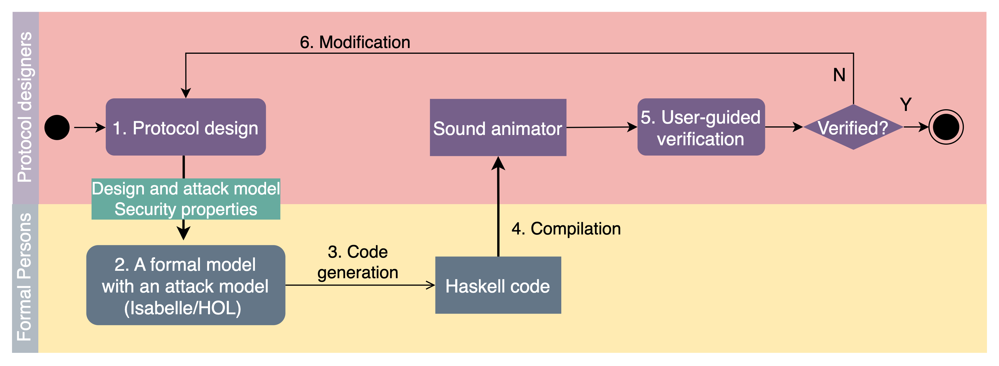
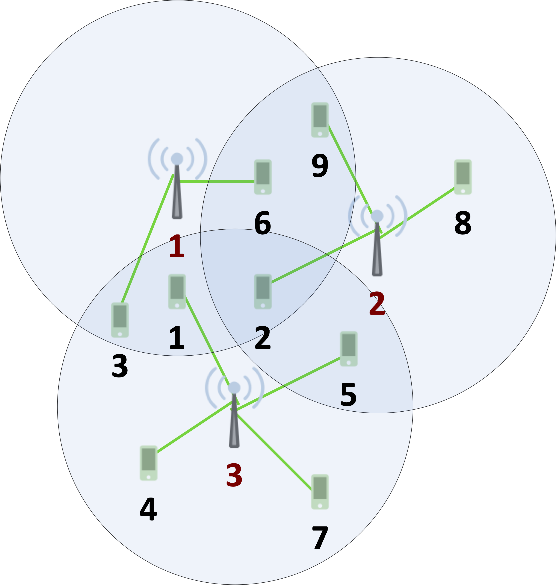
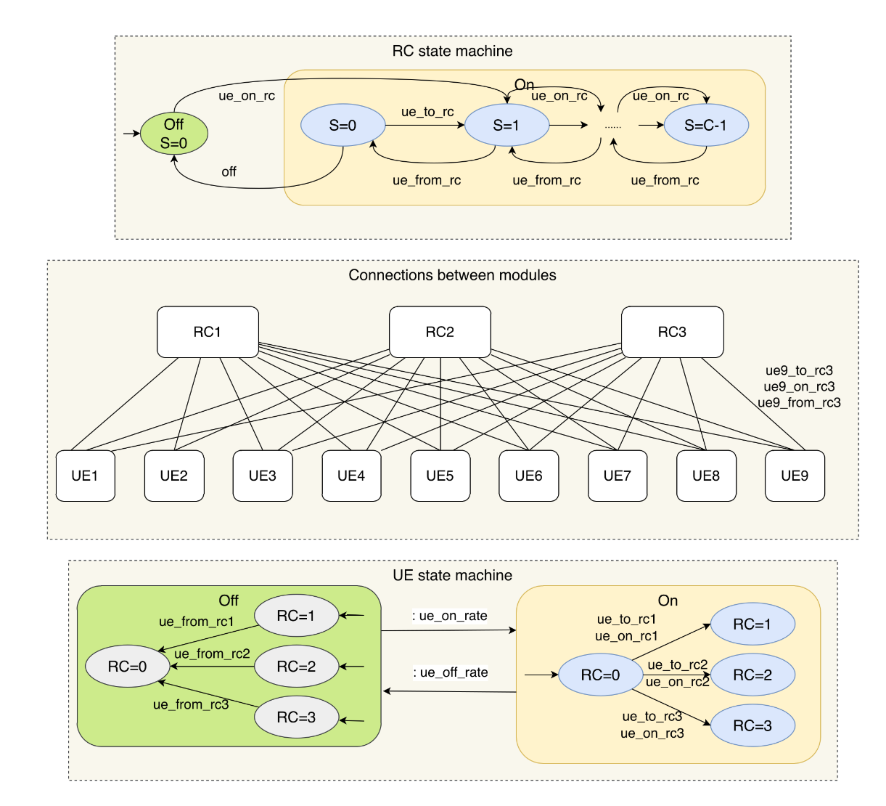
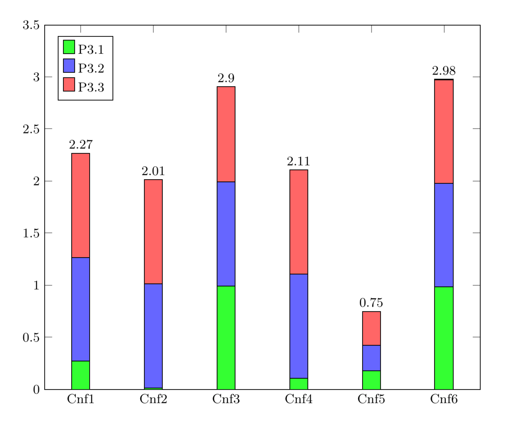

Two papers, for the application of formal verification in security protocols and O-RAN, presented at SEFM24, co-located DataMod24
---

In this week (from November 4th to 8th, 2024), I and my colleague Dr. [Roberto Metere](https://www-users.york.ac.uk/roberto.metere/) from the University of York, are attending [the 22nd International Conference on Software Engineering and Formal Methods](https://sefm-conference.github.io/2024/) (SEFM24, the main conference) and [the 12th International Symposium From Data to Models and Back](https://datamod-symposium.github.io/DataMod-2024/) (DataMod24, the co-located workshop) at the University of Aveiro, Portugal. We both are working on P3.2 in the Pillar 3 of CHEDDAR to apply formal verification in security protocols and O-RAN in 6G.

### SEFM24 presentation

I presented the paper, titled "User-Guided Verification of Security Protocols via Sound Animation", in the main conference on the 7th of November, 2024. It is joint work with Dr. Metere, and [Poonam Yadav](https://www.cs.york.ac.uk/people/yadav). 

#### Challenges

This work addresses the **accessibility** issue of formal verification to security protocols designers by introducing **animation** as a formal way to verify protocols and the **soundness** issue of animation.

- _Accessibility issue_: formal verification is widely used by formal experts to verify security protocols; the specification notations and tools used for verification make them not accessible to designers because of the background knowledge requirement. The consequence of this issue is the workflow from design to verification is **not iterative** because designers are not actively engaged in the verification.
- _Soundness issue_: animation, _allowing users to interact with security models in a user-friendly way,_ is usually achieved through manually-implemented programs, which may have bugs and requires time and effort to develop them. The consequence of this issue is that we **cannot guarantee** a problem detected in animation is a true **bug** in the design, or designers may get a **wrong understanding** of the protocols they design.

The workflow of current practice is shown below where designers are not engaged in the verification.

#### Approach
This paper proposes a new workflow to allow designers to carry our verification in the early stage of design, so the process is **iterative**.

The key elements in this workflow include
- the modelling of security protocols formally as mathematical logics in the theorem prover [Isabelle/HOL](https://isabelle.in.tum.de/) using high-level formal specification, 
- the automatic generation of Haskell code, and 
- the automatic compilation into executable programs (that is, the **animator**).

Most importantly, the generated animator is **sound** in terms of security protocol designs. _In other words, all problems found during verification using the animator are the bugs in the security protocols._

But how designers can use the animators to debug their protocols? The animators support not only the manual exploration of the protocols, but also five automatic modes
- automatic exhaustive search up to given steps for common errors and reachability check,
- automatic random search up to given steps for common errors and reachability check, and
- feasibility check (that is, whether a given trace is possible or not for the protocols).

Indeed, the animator is a **lightweight model checker**.

#### Results
Two popular security protocols, the Needham-Schroeder public key protocol and Diffie–Hellman key exchange protocol, are verified to be subjected to the man-in-the-middle attack with all traces leading to the violation. In addition, the corrected variants are verified to be secure and absent from the attack.

#### Resources
The models and code are available from the GitHub repository: [Animation_of_Security_Protocols](https://github.com/RandallYe/Animation_of_Security_Protocols). The preprint paper is available [here](https://arxiv.org/abs/2410.00676).

### DataMod24 presentation

Dr. Metere presented the paper, titled "Towards Achieving Energy Efficiency and Service Availability in 6G O-RAN via Formal Verification", in DataMod24 on the 4th of November, 2024. This is joint work with Dr. Ye and Yadav from the University of York, Dr. [Yue Gu](https://www.gla.ac.uk/schools/computing/staff/yuegu/) and [Michele Sevegnani](https://www.dcs.gla.ac.uk/~michele/index.html) from the University of Glasgow, and Dr. [Zhi Zhang](https://profiles.imperial.ac.uk/zhi.zhang) and [Dalal Alrajeh](https://www.doc.ic.ac.uk/~da04/) from Imperial College London.

#### Challenges
As Open Radio Access Networks (O-RAN) adoption continues to expand, AI/ML-driven applications (xApps) are increasingly being deployed to enhance and simplify network management. One of the main drivers for utilising AI is its effectiveness in dealing with the complexity and the rapidly evolving nature of real-world network environments. While these approaches show promising results in many scenarios, AI-based management applications can introduce new critical challenges that traditional models did not face. One example is the risk of **misconfiguration** by introducing logical **inconsistencies** when trying to balance between availability, QoS, and power efficiency.

#### Approach
An emerging trend in this area is the application of **formal verification** to address these challenges by providing mathematical guarantees on the behaviour of deployed systems. An established technique used in the past primarily for the development of high-assurance software, its more recent evolution to support **stochastic analysis** has enabled its application to whole system analysis in domains such as reliability of cyber-physical systems and verification of wireless protocols.

This work proposes an approach to use probabilistic model checkers (PRISM and Storm) to quantitatively compute optimal thresholds between energy efficiency and service availability. A scenario considered and modelled in the paper consists of three radio cells (RCs) and 9 user equipments (UEs), as shown below, where the locations of RCs and UEs are fixed but UEs are dynamically switched on and off based on uncertainty.

This paper introduces a control policy to switch an RC on or off, based on the status of the UEs in its covered area, to balance energy efficiency and service availability. The scenario and the policy are described as state machines below and modelled in the PRISM language.

#### Results
The paper considers six configurations where the capacity of RCs (for the maximum number of connected UEs), the on and off rates of UEs, and the location of UEs vary. 

The diagram below shows the power consumption for each RC in different configurations.

The following diagram shows the comparison of service availability (that is, the probability of guaranteed connection for a UE in the given units of time).

More details can be found in the paper.

#### Resources
The PRISM models are available from the [GitHub repository](https://github.com/RandallYe/ORAN-xApp-QoS-PRISM-Models/). The preprint paper is available [here](https://arxiv.org/abs/2411.03943).

